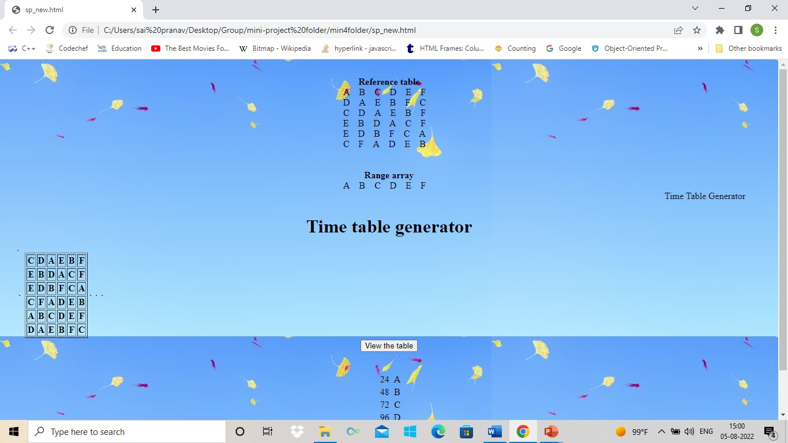

# TimeTableGenerator

This Project is used to decrease the time taken to generate timetable for any institution,workplaces.

The Alphabets in the above image indicates the faculty names, Here to be concise I have used Alphabets. For more information please use the PPT in the repository.
